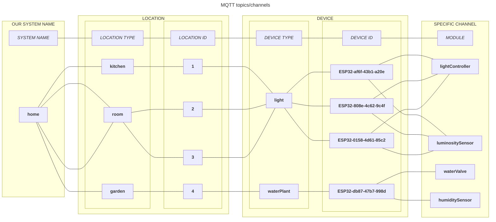
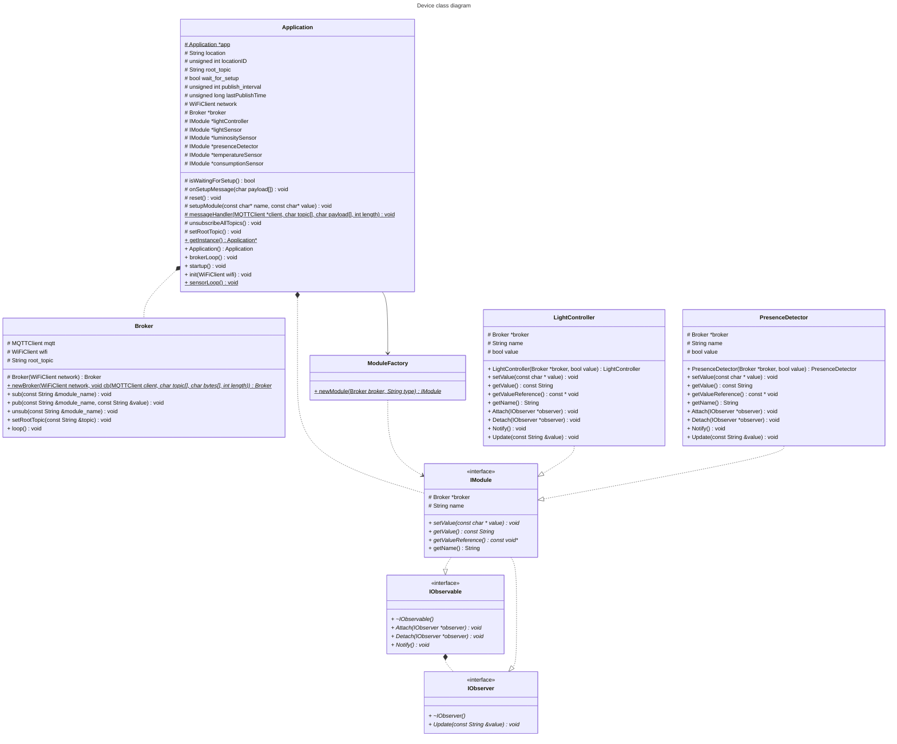
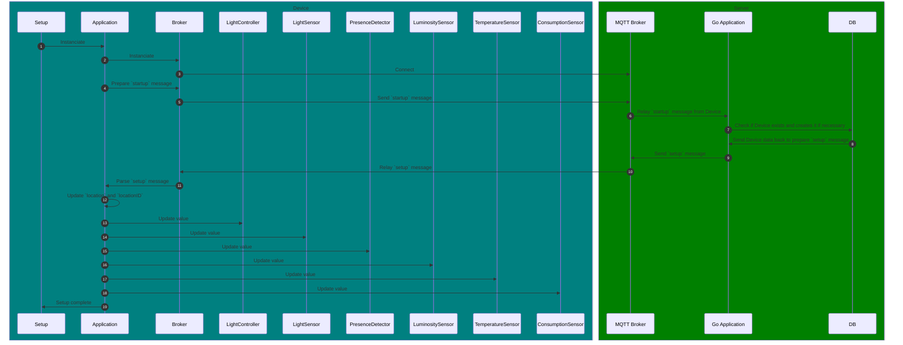
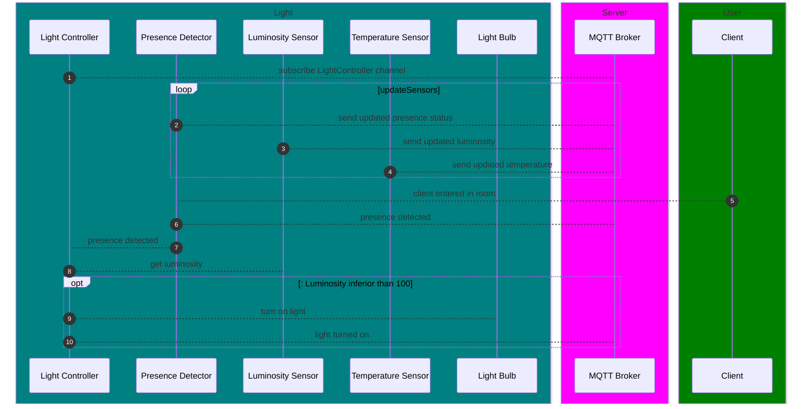

# HomeIoT

<!-- TOC -->
* [MQTT](#mqtt)
* [Startup/Setup message](#startupsetup-message)
* [Class diagram](#class-diagram)
* [Setup sequence diagram](#setup-sequence-diagram)
<!-- TOC -->

---

## MQTT



## Startup/Setup message
```json
{
  "id": "ESP32-af6f-43b1-a20e",
  "type": "light",
  "location_id": 3,
  "location_type": "room",
  "location_name": "room 3",
  "modules": [
    {
      "name": "lightController",
      "value": "False"
    },
    {
      "name": "lightSensor",
      "value": "True"
    },
    {
      "name": "luminositySensor",
      "value": "150.0"
    },
    {
      "name": "presenceDetector",
      "value": "True"
    },
    {
      "name": "temperatureSensor",
      "value": "22.5"
    },
    {
      "name": "consumptionSensor",
      "value": "32.45"
    }
  ]
}
```

## Class diagram


## Setup sequence diagram



