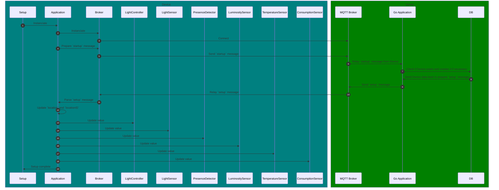

# HomeIoT

```mermaid
---
title: Device class diagram
---
classDiagram
    class Application {
        # Application *app$
        # String location
        # unsigned int locationID
        # String root_topic
        # bool wait_for_setup
        # unsigned int publish_interval
        # unsigned long lastPublishTime
        # WiFiClient network
        # Broker *broker
        # IModule *lightController
        # IModule *lightSensor
        # IModule *luminositySensor
        # IModule *presenceDetector
        # IModule *temperatureSensor
        # IModule *consumptionSensor
        
        # isWaitingForSetup() bool
        # onSetupMessage(char payload[]) void
        # reset() void
        # setupModule(const char* name, const char* value) void
        # messageHandler(MQTTClient *client, char topic[], char payload[], int length) void$
        # unsubscribeAllTopics() void
        # setRootTopic() void

        + getInstance() Application*$
        + Application() Application
        + brokerLoop() void
        + startup() void
        + init(WiFiClient wifi) void
        + sensorLoop() void$
    }
    class Broker {
        # MQTTClient mqtt
        # WiFiClient wifi
        # String root_topic

        # Broker(WiFiClient network) Broker

        + newBroker(WiFiClient network, void cb(MQTTClient *client, char topic[], char bytes[], int length)) Broker*$
        + sub(const String &module_name) void
        + pub(const String &module_name, const String &value) void
        + unsub(const String &module_name) void
        + setRootTopic(const String &topic) void
        + loop() void
    }
    class IModule {
        <<interface>>
        # Broker *broker
        # String name
        + setValue(const char * value) void*
        + getValue() const String*
        + getValueReference() const void**
        + getName() String
    }
    class ModuleFactory {
        + newModule(Broker *broker, String type) IModule*$
    }
    class IObservable {
        <<interface>>
        + ~IObservable()*
        + Attach(IObserver *observer) void*
        + Detach(IObserver *observer) void*
        + Notify() void*
    }
    class IObserver {
        <<interface>>
        + ~IObserver()*
        + Update(const String &value) void*
    }
    class LightController {
        # Broker *broker
        # String name
        # bool value
        
        + LightController(Broker *broker, bool value) LightController
        + setValue(const char * value) void
        + getValue() const String
        + getValueReference() const * void
        + getName() String
        + Attach(IObserver *observer) void
        + Detach(IObserver *observer) void
        + Notify() void
        + Update(const String &value) void
    }
    class LightSensor {
        # Broker *broker
        # String name
        # bool value

        + LightSensor(Broker *broker, bool value) LightSensor
        + setValue(const char * value) void
        + getValue() const String
        + getValueReference() const * void
        + getName() String
        + Attach(IObserver *observer) void
        + Detach(IObserver *observer) void
        + Notify() void
        + Update(const String &value) void
    }
    class PresenceDetector {
        # Broker *broker
        # String name
        # bool value

        + PresenceDetector(Broker *broker, bool value) PresenceDetector
        + setValue(const char * value) void
        + getValue() const String
        + getValueReference() const * void
        + getName() String
        + Attach(IObserver *observer) void
        + Detach(IObserver *observer) void
        + Notify() void
        + Update(const String &value) void
    }
    class LuminositySensor {
        # Broker *broker
        # String name
        # float value

        + LuminositySensor(Broker *broker, float value) LuminositySensor
        + setValue(const char * value) void
        + getValue() const String
        + getValueReference() const * void
        + getName() String
        + Attach(IObserver *observer) void
        + Detach(IObserver *observer) void
        + Notify() void
        + Update(const String &value) void
    }
    class TemperatureSensor {
        # Broker *broker
        # String name
        # float value

        + TemperatureSensor(Broker *broker, float value) TemperatureSensor
        + setValue(const char * value) void
        + getValue() const String
        + getValueReference() const * void
        + getName() String
        + Attach(IObserver *observer) void
        + Detach(IObserver *observer) void
        + Notify() void
        + Update(const String &value) void
    }
    class ConsumptionSensor {
        # Broker *broker
        # String name
        # float value

        + ConsumptionSensor(Broker *broker, float value) ConsumptionSensor
        + setValue(const char * value) void
        + getValue() const String
        + getValueReference() const * void
        + getName() String
        + Attach(IObserver *observer) void
        + Detach(IObserver *observer) void
        + Notify() void
        + Update(const String &value) void
    }
    Application *.. IModule
    ModuleFactory ..> IModule
    Application --> ModuleFactory
    Application *.. Broker
    LightController ..|> IModule
    LightSensor ..|> IModule
    PresenceDetector ..|> IModule
    LuminositySensor ..|> IModule
    TemperatureSensor ..|> IModule
    ConsumptionSensor ..|> IModule
    LightController *.. Broker
    LightSensor *.. Broker
    PresenceDetector *.. Broker
    LuminositySensor *.. Broker
    TemperatureSensor *.. Broker
    ConsumptionSensor *.. Broker
    IObservable *.. IObserver
    IModule ..|> IObserver
    IModule ..|> IObservable
```

```mermaid
sequenceDiagram
    autonumber
    box Teal Device
    participant S as Setup
    participant A as Application
    participant B as Broker
    participant LiC as LightController
    participant LiS as LightSensor
    participant PD as PresenceDetector
    participant LuS as LuminositySensor
    participant TS as TemperatureSensor
    participant CS as ConsumptionSensor
    end
    box Green Server
    participant MQTT as MQTT Broker
    participant Server as Go Application
    participant DB
    end
    S ->> A: Instanciate
    A ->> B: Instanciate
    B ->> MQTT: Connect
    A ->> B: Prepare `startup` message
    B ->> MQTT: Send `startup` message
    MQTT ->> Server: Relay `startup` message from Device
    Server ->> DB: Check if Device exists and creates it if necessary
    DB ->> Server: Send Device data back to prepare `setup` message
    Server ->> MQTT: Send `setup` message
    MQTT ->> B: Relay `setup` message
    B ->> A: Parse `setup` message
    A ->> A: Update `location` and `locationID`
    A ->> LiC: Update value
    A ->> LiS: Update value
    A ->> PD: Update value
    A ->> LuS: Update value
    A ->> TS: Update value
    A ->> CS: Update value
    A ->> S: Setup complete
```